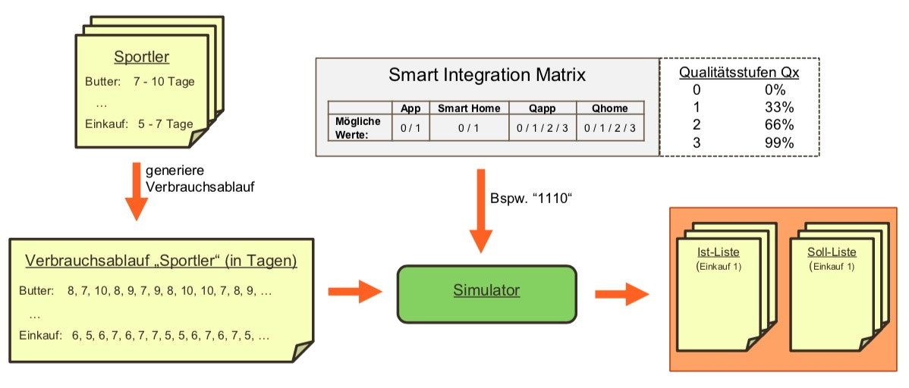
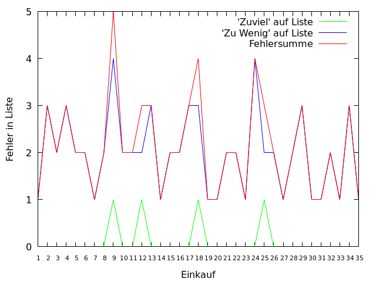
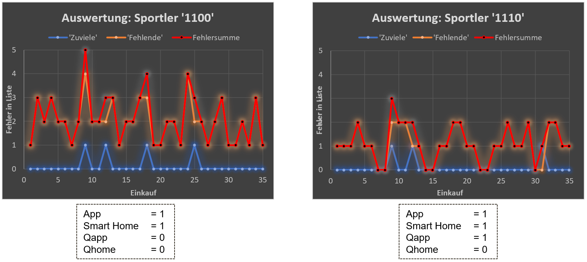
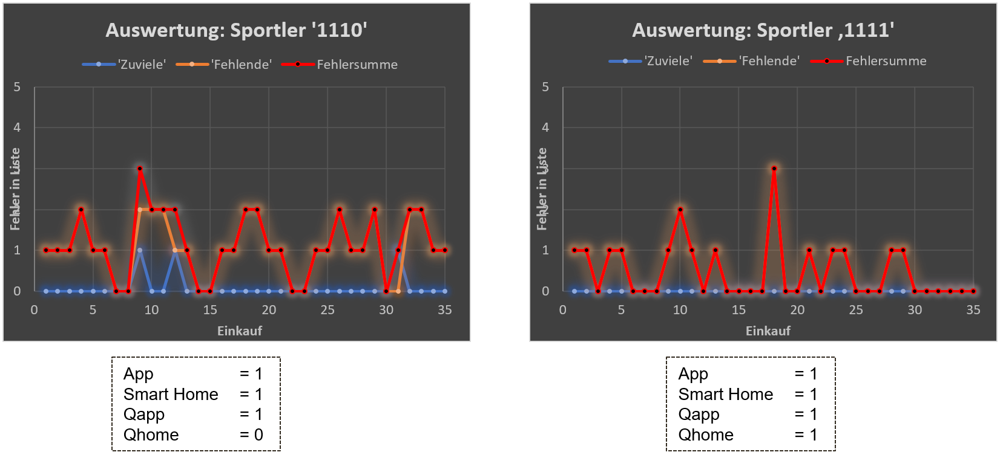
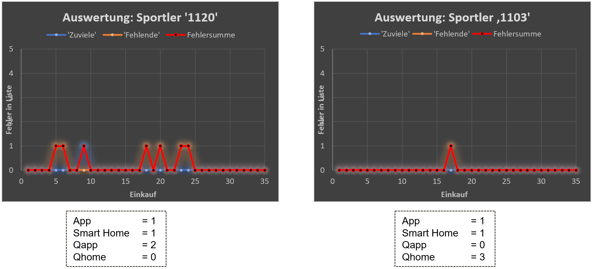

# Simulation und Auswertung

## Definitionen

Im folgenden werden die in der Simulation verwendeten Hilfsmittel und Bausteine dargestellt, um die Aussagekraft der Simulation und derer Ergebnisse zu veranschaulichen. Die folgenden Definitionen sind Teil der durchgeführten Simulation und bieten die Grundlage zum Verständnis der nachfolgenden Simulationsdokumentation.

### Bewertungskriterien

Bevor wir mit der Simulation begannen, definierten wir zuerst die der Simulation zu Grunde gelegten Bewertungskriterien. Bewertet werden soll allgemein gesagt die Nützlichkeit der vorgestellten Applikationen im Bezug auf den Einkaufsprozess.  
Da unsere Applikation\(en\) den Einkaufsprozess anhand einer digitalen Einkaufsliste verbessern, liegt der Fokus auf der Korrektheit der automatisch generierten Einkaufsliste. D.h. uns interessiert das sogenannte Delta zwischen der automatisch generierten Einkaufsliste \(Ist-Liste\) und der optimales Einkaufliste \(Soll-Liste\) um die Korrektheit der Liste überhaupt bewerten zu können.  
Um die Korrektheit zwischen den zwei Listen einheitlich zu messen, haben wir folgende zwei Metriken festgelegt:

* Anzahl der Produkte auf Soll-Liste, die auf der Ist-Liste fehlen  --&gt; im Folgenden als 'Zu Wenig' bezeichnet
* Anzahl der Produkte auf Ist-Liste, die nicht auf Soll-Liste stehen --&gt; im Folgenden als 'Zuviel' bezeichnet

### Persona

Entspricht in diesem Zusammenhang bestimmten Konsum- & Verbrauchsdaten über eine bestimmte Person oder einen Personenkreis. Eine Persona definiert sich dabei durch eine Menge von Produkten die regelmäßig \(oder auch unregelmäßig\) gekauft werden, mit zusätzlicher Angabe des durchschnittlichen Verbrauchs in Form von Intervallen. Zusätzlich zu den Verbrauchs-/Bedarfsinformationen wird eine Einkaufshäufigkeit in Form eines Intervalls angegeben. D.h. zusammengefasst ist für bestimmte Produkte deren Bedarfshäufigkeit in einer Persona definiert, sowie auch dessen allgemeint Einkaufshäufigkeit \(in gleicher Form\).

Die folgende Tabelle veranschaulicht dies am Beispiel einer **Sportler-Persona**:

| Produkt | Bedarfshäufigkeit \(Sportler\) |
| :--- | :---: |
| Butter | 17 - 22 Tage |
| Milch |  3 - 7 Tage |
| Käse | 7 - 10 Tage |
| Salami | 5 - 7 Tage |
| Joghurt | 20 - 25 Tage |
| --------------- | --------------- |
| _Einkaufshäufigkeit_ | _4 - 6 Tage_ |

### Smart Integration Matrix


Die Smart Integration Matrix zeigt die in unserem Szenario möglichen Varianten wie eine Einkaufsliste befüllt werden kann. Dabei sind für die zwei definierten Möglichkeiten \('Manuell', 'Smart Home'\) jeweils Qualitätsstufen angegeben, welche das Maß der Qualität der Nutzung der zwei Verwaltungsmöglichkeiten darstellt. Diese Qualitätsstufen können Werte zwischen 0 und 3 annehmen, wobei eine '0' bedeute, dass diese Komponente nicht verwendet wird und eine '3' einer sehr sorgfältigen Verwendung entspricht.

Die Tabelle der möglichen Werte ist im Folgenden dargestellt: 

|  | **App** |    | **Smart Home** | **Qapp** | **Qhome** |
| :--- | :--- | :--- | :--- | :--- | :--- |
| Mögliche Werte: | 0 / 1 |    | 0 / 1 | 0 / 1 / 2 / 3 | 0 / 1 / 2 / 3 |

Die möglichen Werte \(0 / 1\) in Spalte App und Smart Home geben an, ob die Komponente verwendet wird. Die in Spalten Qapp und Qhome angegebenen Qualitätsmaße geben an, wie gut die bestimmte Komponente verwendet wird. Die Quaitätsstufen sind vordefinierten Aufnahme-Wahrscheinlichkeiten zugeordnet. Diese Aufnahme-Wahrscheinlichkeit gibt an, mit welcher Wahrscheinlichkeit ein Produkt zum Zeitpunkt des Verbrauchs oder des Ablaufs durch die entsprechende Komponente vom Nutzer in die Einkaufsliste aufgenommen wird.  
Dieser Zuordnung ist in folgender Tabelle dargestellt:

| Qualitätsstufe | Beschreibung | Aufnahme-Wahrscheinlichkeit |
| :--- | :--- | :--- |
| 0 | keine Verwendung | 0% |
| 1 | gelegentliche Verwendung | 33% |
| 2 | mittelmäßige Verwendung | 66% |
| 3 | sorgfältige Verwendung | 99% |

In der Simulation verwenden wir diese Matrix, um verschiedenste Verhaltensweisen bezüglich der Pflege des Einkaufszettels der Nutzer nachstellen zu können. Anhand der Simulation kann anschließend der Nutzen unserer Anwendungen für die verschiedensten Verhaltensweisen gemessen werden. Auf Basis dieser Simulation können zudem geeignete Nutzungsstrategien der vorhandenen Technologien empfohlen werden, um die Präzision des Zettels zu verschärfen.

## Simulationsaufbau



_Abbildung 4.1_ fasst den Simulationsaufbau zusammen. Der Ablauf der Simulation enthält folgende Schritte:

* **Erstellung einer Persona** Beispielsweise ein Sportler der Butter innerhalb von 17 bis 22 Tagen verbraucht hat und alle 5 bis 7 Tage einkaufen geht. Im folgenden Codeblock ist eine beispielhafte Definition einer Persona in unserer Applikation dargestellt.



```text
// Persona Definition: Beispiel Sportler
Map<String, Produkt> sportlerProduktMap = new HashMap<String, Produkt>();

public void setSportlerProduktMap() {
	sportlerProduktMap.put("Butter", new Produkt("Butter", 17, 22));
	sportlerProduktMap.put("Milch", new Produkt("Milch", 3, 7));
	sportlerProduktMap.put("Kaese", new Produkt("Kaese", 7, 10));
	sportlerProduktMap.put("Salami", new Produkt("Salami", 5, 7));
	sportlerProduktMap.put("Joghurt", new Produkt("Joghurt", 20, 25));
}
```



* **Erstellung vom Verbrauchsablauf** Auf Basis der vordefinierten Personadaten wird ein Verbrauchs- sowie Einkaufsablauf erzeugt, aus welchem sich eine ideale Einkaufsliste \(Soll-Liste\) für die Persona ableiten lässt. Diese ideale Einkaufsliste wird als csv-Datei für die weitere Verarbeitung bzw. Auswertung abgelegt. Im folgenden Codeblock wird die ideale Liste dargestellt. Dabei entspricht die erste Spalte Zahlen dem Einkaufsablauf und die darauf folgende Liste den benötigten Produkten zum Zeitpunkt dieses Einkaufs.



```text
---------------------------
-----Soll-Einkaufsliste-----
---------------------------
4;Milch;
7;Milch;Kaese;Salami;
13;Milch;Salami;
17;Butter;Milch;Kaese;
20;Salami;Joghurt;
25;Milch;Salami;
28;Kaese;
32;Milch;Salami;
...
```



* **Abbildung der Smart Integration Matrix** Die festgelegten Matrix-Werte werden dem Simulator als Parameter übergeben 
* **Simulation** Die Simulation erfolgt, indem die Methode _simuliereAblauf\(\)_ aufgerufen wird. Diese Methode bildet den Simulator ab und nimmt  neben den Matrix-Werten eine bestimmte Persona, ihre ideale Liste und den Zeitraum über den die Simulation ablaufen darf als Parameter.  Der Ablauf ist wie folgt: Es wird über jeden Tag iteriert und dabei basierend auf den Qualitätsstufen der verwendeten Komponenten \(App oder Smart Home Gerät\) durch Zufall das Setzen der Produkte auf die Einkaufsliste simuliert. Anschließend wird, im Falle eines Einkaufstages, die Soll- und Ist-Einkaufsliste gespeichert und zusätzlich die Einkaufsliste geleert. Das Leeren der Einkaufsliste wird in unserem Use-Case automatisiert durchgeführt, da wir von einer Integration eines smarten Kassensystems ausgehen, welches uns den Zeitpunkt und Informationen eines Kaufs übermittelt. In Kapitel 'Implementierung' ist eine prototypische Umsetzung eines solchen Kassensystems dargestellt.



```text
public void simuliereAblauf(Persona persona, Map<Integer,
		int zeitRaum, boolean appTouchPoint, boolean homeTouchPoint,
		int Qapp, int Qhome, String dateiName) throws ParseException {
	
	Map<Integer, List<String>> istEinkaufsListeMap = new HashMap<>();
	Map<Integer, List<Produkt>> sollEinkaufsListenMap = sollService.erstelleSollEinkaufslistenBeimEinkauf(persona, zeitRaum);
	List<Integer> sollEinkaufsListenMapKeys = sollService.sortiereSollMapKey(sollEinkaufsListenMap);
	
	// Starte Simulation fuer vorgegebenen 'zeitRaum'
	for(int i=1; i<=zeitRaum; i++) {
		// erstelle Sollliste für Tag i
		List<Produkt> sollListeTagI= sollService.erstelleSollEinkaufsListe(persona, i);
		
		// hole generierte Einkaufsliste (von der App)
		einkaufslistenGenerator.get_berechneteEinkaufsliste(1, i);
		
		// setze ggf. verbrauchte Produkte auf die istEinkaufsliste
		List<String> istEinkaufsliste = istService.get_einkaufsliste(1);
		
		// Ermittle Qualitätsstufe(n)
		double pApp = 0.0;
		switch (Qapp) {
		case 1:
			pApp=0.33;
			break;	
		case 2:
			pApp=0.66;
			break;
		case 3:
			pApp=0.99;
			break;
		default:
			appTouchPoint=false;
			break;
		}
		
		double pHome = 0.0;
		switch (Qhome) {
		case 1:
			pHome=0.33;
			break;
		case 2:
			pHome=0.66;
			break;
		case 3:
			pHome=0.99;
			break;
		default:
			homeTouchPoint=false;
			break;
		}
		
		// Simuliere 'Setzen auf Liste'
		for(Produkt produkt : sollListeTagI) {
			if(einkaufslistenGenerator.itemAlreadyExist(istEinkaufsliste, produkt.getName())==false) {
				if (appTouchPoint && Math.random() <= pApp) {
					istService.put_Product_On_Einkaufsliste(1, produkt.getName(), i);
					istEinkaufsliste = istService.get_einkaufsliste(1);
				}
			}if(einkaufslistenGenerator.itemAlreadyExist(istEinkaufsliste, produkt.getName())==false) {
			
				if (homeTouchPoint && Math.random() <= pHome) {
					istService.put_Product_On_Einkaufsliste(1, produkt.getName(), i);
					istEinkaufsliste = istService.get_einkaufsliste(1);
				}
			}
		}
		istEinkaufsliste = istService.get_einkaufsliste(1);
		
		// Überprüfen, ob Tag i Einkaufstag ist
		if(sollEinkaufsListenMapKeys.contains(i)) {
			istEinkaufsListeMap.put(i, istEinkaufsliste);
			
			for(String produktName : istEinkaufsliste) {
				istService.buy_Product_From_Einkaufsliste(produktName, 1, i);
				istEinkaufsliste = istService.get_einkaufsliste(1);
			}
		}
		
	}
	// Ausgabe der Einkaufslisten
	einkaufslistenGenerator.schreibeGenerierteEinkaufslistenInEinerDatei(istEinkaufsListeMap, dateiName);
	sollService.schreibeSollEinkaufslistenInEinerDatei(sollEinkaufsListenMap, "sollEinkaufsListe.csv");
}
```



* **Auswertung** Um eine Auswertung durchzuführen werden die zuvor in der Simulation erzeugten Soll- und Ist-Einkaufslisten in Form von csv-Tabellen miteinander verglichen. Dabei werden die zwei zuvor definierten Metriken gemessen und festgehalten und somit eine Art Fehlerquote bestimmt. Der folgende Bash-Codeausschnitt zeigt den zuvor beschriebenen Vergleich der Listen und das bestimmen der zwei Metriken.



```text
#!/bin/bash

istList=$1
sollList=$2

# Laufe über jeden in der Liste befindlichen Eintrag/Einkaufstag
while read lineSoll
do
	if [ `echo $lineSoll | grep ^[0-9]` ]
	then	
		shoppingDay=$(echo $lineSoll | cut -d";" -f1)
		lineIst=$(cat $istList | grep "^$shoppingDay;")
		
		if [ -z "$lineIst" ]
		then
			echo "No Shoppinglist available for day $shoppingDay" >> /dev/stderr
			continue
		fi

		# Metriken bestimmen
		anzahlZuviele=0
		for productIst in `echo "$lineIst" | sed 's/^[0-9]*;//g' | sed 's/;$//g' | tr ";" "\n"`
		do
			needed=0
			for productSoll in `echo "$lineSoll" | sed 's/^[0-9]*;//g' | sed 's/;$//g' | tr ";" "\n"`
			do
				if [ "$productIst" == "$productSoll" ]
				then
					needed=1
				fi
			done
			if [ $needed == 0 ]
			then
				anzahlZuviele=$((anzahlZuviele + 1))
			fi

		done
		
		historie_anzahlZuviele+=($anzahlZuviele)
		
		anzahlFehlende=0
		for productSoll in `echo "$lineSoll" | sed 's/^[0-9]*;//g' | sed 's/;$//g' | tr ";" "\n" `
		do
			inList=0
			for productIst in `echo "$lineIst" | sed 's/^[0-9]*;//g' | sed 's/;$//g' | tr ";" "\n"`
			do
				if [ "$productSoll" == "$productIst" ]
				then
					inList=1
				fi
			done
			if [ $inList == 0 ]
			then
				anzahlFehlende=$((anzahlFehlende + 1))
			fi
		done

		historie_anzahlFehlende+=($anzahlFehlende)

		einkaufstag=`echo $lineSoll | cut -d";" -f1`
		historie_Einkaufstage+=($einkaufstag)

		anzahlSoll=`echo "$lineSoll" | sed 's/^[0-9]*;//g' | sed 's/;$//g' | tr ";" "\n" | wc -l`
		anzahlIst=`echo "$lineIst" | sed 's/^[0-9]*;//g' | sed 's/;$//g' | tr ";" "\n" | wc -l`
	fi
done < $sollList
```



Aus den zuvor bestimmten Metrik-Werten wird im Anschluss eine csv erstellt. Zusätzlich wird eine dat-Datei für das grafische Darstellungstool Gnuplot erstellt und ausgeführt, um die ausgewerteten Ergebnisse anhand eines Graphen besser analysieren zu können. _Abbildung 4.2_ zeigt ein Beispiel der aus Gnuplot entstandenen Grafik einer durchgeführten Auswertung. Dabei werden die zwei Metriken 'Zuviel' und 'Zuwenig' dargestellt, sowie eine Summe derer beiden als Fehlersumme.




## Simulationsergebnisse

Die Simulationsergebnisse setzen sich aus dem Vergleich von verschiedenen Ausprägungen von Personas und Belegung der Werte der Smart Integrations Matrix zusammen. Wir haben uns im Folgenden auf die unter Definitionen dargestellte Persona 'Sportler' beschränkt. Um nun die Unterschiede in der Qualität der Liste bei unterschiedlicher Verwendung der zwei Komponenten hervorzuheben, haben wir für einen festen Verbrauchsablauf unterschiedliche Werte der Smart Integrations Matrix zur Auswertung verwendet. In _Abbildung 4.3_ ist der Vergleich der Auswertung einer '1100'-Belegung einer '1110'-Belegung gegenübergestellt. Eine Belegung von '1100' bedeutet, dass der User die App und das Smart Home verwendet, jedoch jeweils mit Qualtätsstufe 0. In diesem Fall wird die Einkaufsliste also rein nur auf Basis der vorhandenen Verbrauchs- und MHD-Statistiken bestimmt. Da der User in unserem Beispiel jedoch nie sein Verbrauch erfasst hat, werden die Prognosen rein auf Basis der MHD-Daten bestimmt.   
Der Unterschied in der Belegung '1110' im Vergleich zu '1100' ist lediglich, dass der User die App mit Qualitätsstufe 1 verwendet, also mit einer 33%ige Wahrscheinlichkeit ein Produkt bei Verbrauch über die App erfasst. 



Wie im Vergleich zu erkennen ist, wird bereits durch einen geringen Zuwachs an Informationen über das Verbrauchsverhalten, die generierten Ist-Einkaufslisten deutlich präziser. Dies wird auch in _Abbildung 4.4_ deutlich. Belegung '1111' verwendet im Vergleich zu '1110' zusätzlich Smart Home mit Qualitätsstufe 1, d.h. es wird ein weiterer Kanal zur Erfassung des Verbrauchs verwendet, welcher die Ergebnisse nochmals deutlich verfeinern.



Der letzte Vergleich in _Abbildung 4.5_ soll den Unterschied verdeutlichen, welchen Gain die Kanalerweiterung via Smart Home erfüllt. Die Qualität der Ergebnisse kann durch smarte Geräte, die ggf. sogar automatisiert Verbrauchsinformationen erfassen können, stark verbessert werden. Eine manuelle Verwaltung seiner Liste via App wäre somit nicht notwendig, bzw. würde die Qualität der Informationen bei manueller Verwaltung nur noch weiter verbessert werden.



Die von uns durchgeführten Auswertungen sind nur ein kleiner Teil möglicher Simulationen. Der Aufbau dieses Simulators kann auf unzählige weitere Personas und derer SIM-Kombinationen angewendet werden, um die Effekte der verschiedenen Informationskanäle analysieren zu können.


