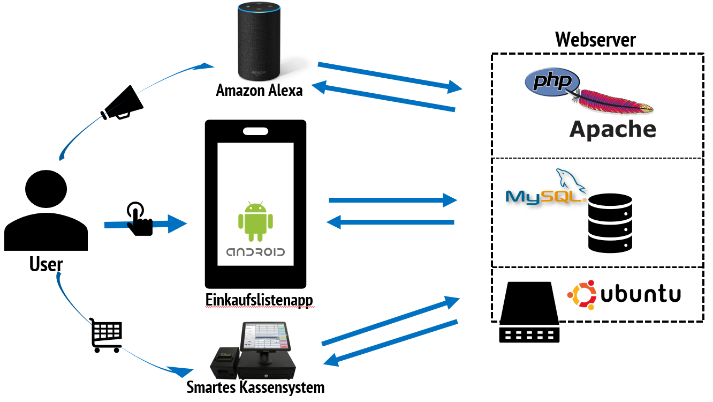
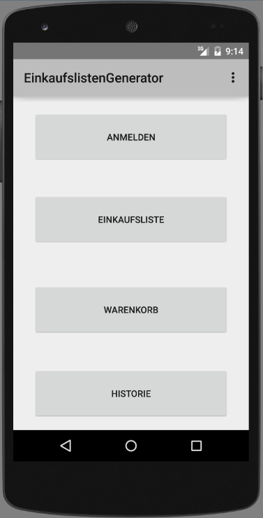
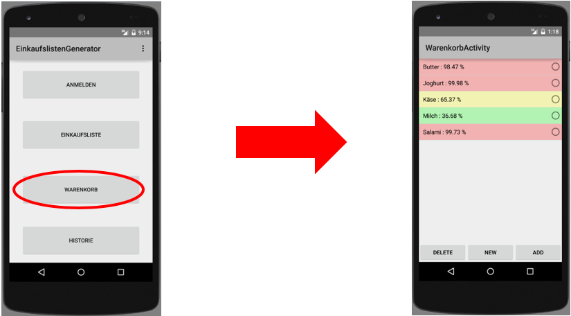
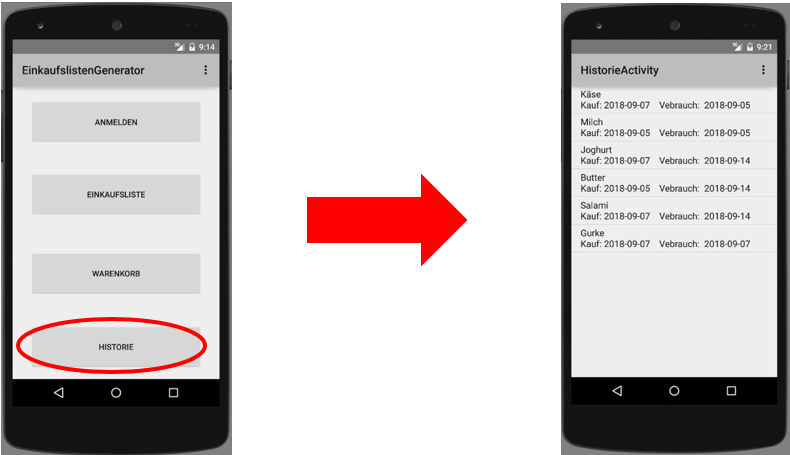
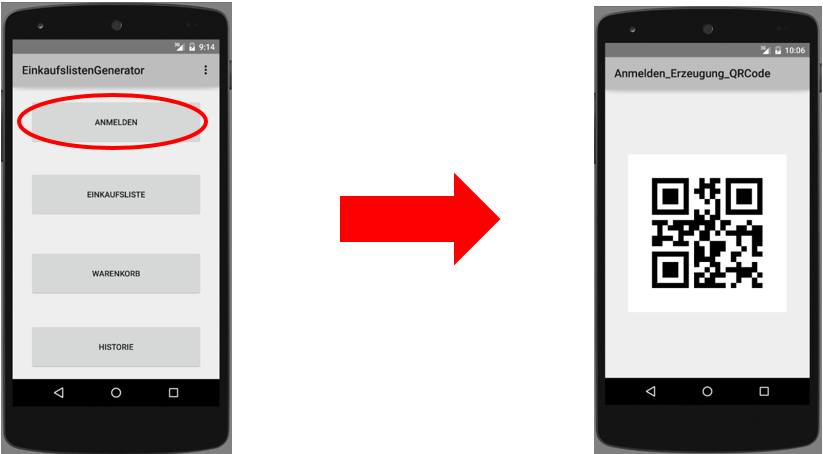
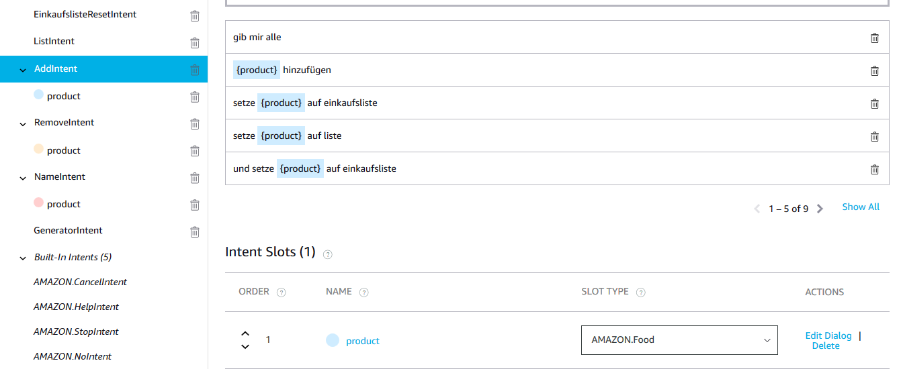
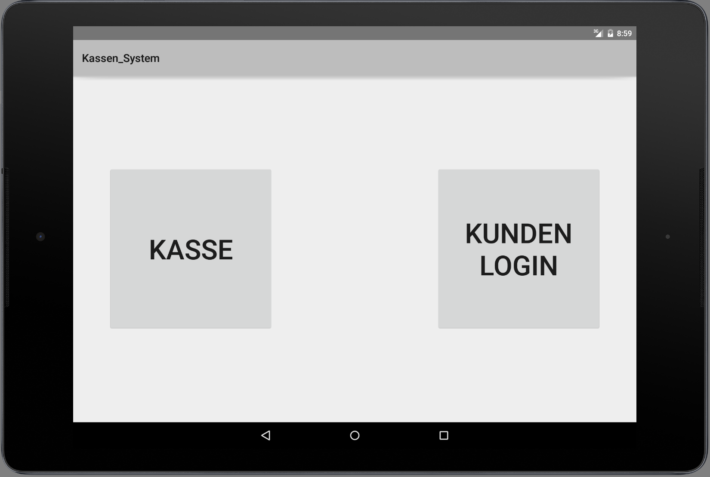
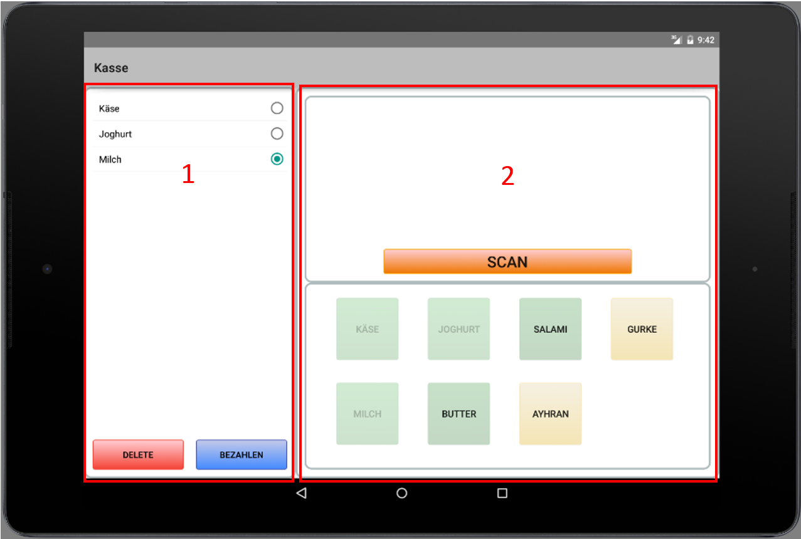
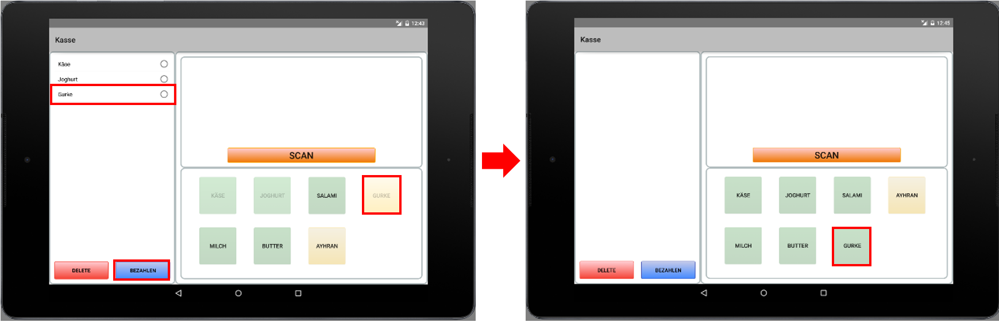
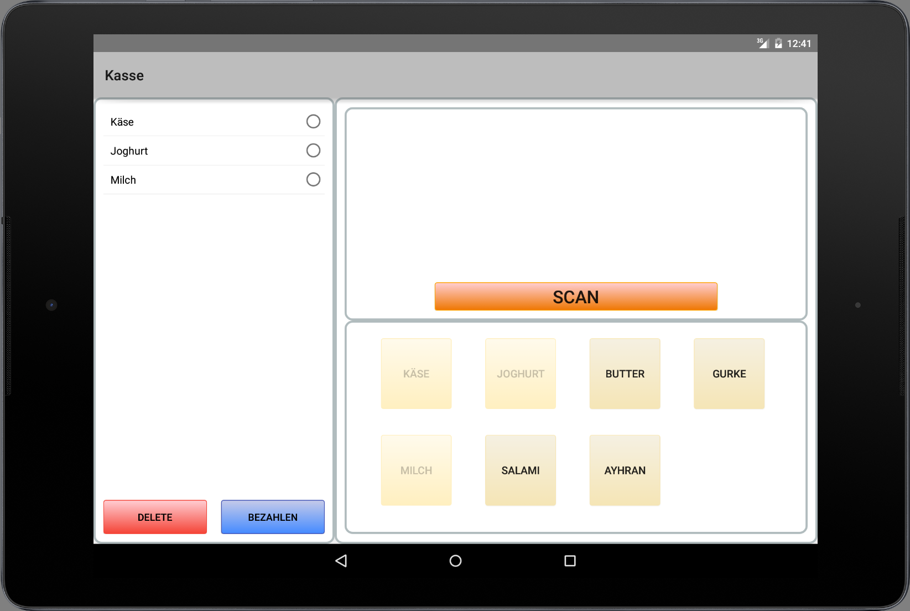

# Implementierung

## Übersicht Gesamtarchitektur



## Einkaufslisten-App

**Bezeichnung:** Einkaufslistengenerator

**Betriebssystem:** Android

**Anforderungen an die App:**

* Anzeige und Verwaltung einer Einkaufsliste
* Anzeige und Verwaltung eines Warenkorbs
* Anzeige einer Einkaufs- und Verbrauchshistorie der jeweiligen Produkte im Warenkorb
* Berechnung der kumulativen Verbrauchswahrscheinlichkeit, der jeweiligen Produkte im Warenkorb
* Farbliche und prozentuale Anzeige der Verbrauchswahrscheinlichkeit der Produkte im Warenkorb
* Aufnahme des Kauf- und Verbrauchsdatums bei Verwaltung der Einkaufsliste und des Warenkorbs und die Speicherung der Daten in einer MySQL Datenbank
* Automatisches setzen von Produkte im Warenkorb auf die Einkaufsliste, die einen höheren Verbrauchswahrscheinlichkeitswert haben als der festgelegte Schwellwert
* Erzeugung und Anzeige eines QR-Codes, welcher den Benutzernamen / Anmeldename enthält. \(Für die Registrierung an der Kasse\)
* Anzeige und Bearbeitung der Daten sind Benutzer- bzw. Kundenspezifisch


Unter **Warenkorb** versteht man in dieser Dokumentation die Sammlung der Produkte, die der Kunde in der Vergangenheit bereits mindestens einmal erworben hat.  
Dies entspricht i.d.R. einer Liste der Produkte, die ein bestimmter Kunde regelmäßig benötigt.


**Startmaske**



In _Abbildung 3.1_ ist die Startmaske zu sehen, die beim Öffnen der App angezeigt wird. Bevor die App die Maske erzeugt, mit all ihren Oberflächenkomponenten, baut sie eine Verbindung zu einer MySQL Datenbank auf. Grund dafür ist, dass erst alle relevanten benutzerspezifischen Daten, wie Warenkorb, Einkaufsliste und Historie, geladen werden, um zu verhindern, dass während der Bedienung zu viele Datenbankzugriffe getätigt werden, wodurch die Perfomance der Applikation steigt. Verbindungen zur Datenbank werden minimiert, indem nur relevante oder benötigte Updates in oder von der Datenbank übermittelt werden, wie z.B. beim Neuladen oder beim Öffnen einer neuen Maske.

Eine weitere Operation welche die App beim Erzeugen der Startmaske ausführt, ist die Berechnung der kumulativen Verbrauchswahrscheinlichkeit der jeweiligen Produkte im Warenkorb. Die Berechnung vorher auszuführen bringt den Vorteil, dass das Öffnen des Warenkorbs und die Anzeige der Maske, welche die Verbrauchswahrscheinlichkeit der jeweiligen Produkte darstellt, performanter durchgeführt werden können. Dies wurde eingeführt, da längere Ladezeiten zwischen den Operationen, vom User als mehr störend empfunden werden, als eine längere Ladezeit beim Starten der App.

Um die kumulative Wahrscheinlichkeit zu berechnen, wird bei der Implementierung eine „Math“ Java-Bibliothek benötigt, welche Methoden besitzt, die es ermöglichen eine empirische Verteilung \(relative Häufigkeit\) zu berechnen und daraus anschließend die kumulative Wahrscheinlichkeit in Form einer Verteilungsfunktion zu bilden.   
Die Verteilungsfunktion wird auf Basis der Verbrauchsdaten und den MHD-Daten der jeweiligen Produkte erzeugt. Die Verbrauchsdaten des jeweiligen Users, sind eine Sammlung von „Verbrauch in Tagen“-Werten, also Werten die aus der Differenz vom Verbrauchsdatum und vom Kaufdatum gebildet werden. Die kumulative Wahrscheinlichkeit pro Produkt wird dann, mit Hilfe der erzeugten Verteilungsfunktion und den abgelaufenen Tagen seit dem letzten Einkauf \(Today\(\) - KaufDatum\(\)\) berechnet.

**Vorschau Coding:**

```text
// Berechnet die kumulative Wahrscheinlichkeit aus einer empirische Verteilungsfunktion 
public double cumulativeProbability(double[] produktDaten, double abgelaufeneTage) {
	EmpiricalDistribution empDist = new EmpiricalDistribution();
	empDist.load(produktDaten);
	
	double cumulativeProbability = empDist.cumulativeProbability(abgelaufeneTage);
	return cumulativeProbability;
}
```

**Warenkorb**



Wie in _Abbildung 3.2_ zu sehen öffnet sich durch betätigen des „Warenkorb“-Buttons die Warenkorbmaske. Wie man direkt sehen kann sind die jeweiligen Produkte mit ihrer Verbrauchswahrscheinlichkeit und einer Farbe \(rot, grün oder gelb\) markiert. Wie schon erwähnt werden die Wahrscheinlichkeiten schon beim Starten der App berechnet und den Produkten zugewiesen.

In welchen Farben die Produkte markiert werden hängt davon ab, ob die Wahrscheinlichkeiten über und unter festgelegten Schwellwerten liegen:

| Farbe | Wertebereich |
| :--- | :--- |
| Grün | x &lt;= 50% |
| Gelb | 50% &lt; x &lt; 90% |
| Rot | x &gt;= 90% |

Die Farben sollen für den User eine Hilfestellung sein, um besser zu erkennen wie der Bestand seiner Produkte ist. Dafür nutzt die App ein Ampelsystem. Rot soll klar machen das, das jeweilige Produkt mit einer sehr hohen Wahrscheinlichkeit verbraucht ist und auf die Einkaufsliste gesetzt werden sollte. Gelb soll eine kleine Warnung geben das, das Produkt eventuell beim nächsten oder übernächsten Einkauf,  auf die Einkaufsliste gesetzt werden sollte. Die Grüne Markierung kennzeichnet, dass der Bestand mit einer sehr hohen Wahrscheinlichkeit ausreichend ist.

Die App beinhaltet jedoch die Funktion, dass wenn ein Produkt im roten Bereich liegt, es automatisch auf die Einkaufsliste gesetzt wird. Das nimmt dem User die Arbeit ab, die jeweiligen Produkte manuell in die Einkaufsliste zu setzen. Wenn ein Produkt vom Warenkorb auf die Einkaufsliste gesetzt wird, dann wird dieser Zeitpunkt als Verbrauchsdatum gewertet und in die Verbrauchshistorie bzw. Datenbank aufgenommen.

Der Warenkorb kann natürlich auch manuell bedient werden, indem eines der Produkte über den RadioButton markiert wird und einer der folgenden drei Buttons betätigt wird, wie in _Abbildung 3.3_ zu sehen:

* **Button 'DELETE':** Produkt wird aus dem Warenkorb entfernt
* **Button 'NEW':** Ein neues Produkt kann im Warenkorb aufgenommen werden
* **Button 'ADD':** Produkt wird in die Einkaufsliste gesetzt, als Verbrauchsdatum aufgenommen und in der Historie eingetragen. Zusätzlich wird noch ein Eintrag in die Verbrauchsstatistik durchgeführt, d.h. die Zeitspanne vom letzten Kaufdatum des Produktes, bis zum aufgenommen Verbrauchsdatum wird erfasst.
* _**Diese Funktionen werden unabhängig vom verwendeten Kanal zur Erfassung \(wie z.B. Amazon Alexa\), ebenfalls ausgeführt.**_ 

**Einkaufsliste**


Wie in _Abbildung 3.3_ sehr gut zu sehen ist, werden Produkte, die rot markiert bzw. bei denen die Verbrauchswahrscheinlichkeit über dem Schwellwert von 90% liegen, automatisch auf die Einkaufsliste gesetzt.

Die Einkaufliste kann auch, wie der Warenkorb, manuell bedient werden. Durch markieren eines Produktes, durch den RadioButton, kann das Produkt entweder von der Liste gelöscht oder abgehakt werden.   
Diese Funktionen sind durch die beiden Buttons „DELETE“ und „CHECK“ realisiert:

* **Button 'DELETE':** Markiertes Produkt wird aus der Liste gelöscht, bspw. Weil das Produkt ausversehen auf die Einkaufsliste gesetzt wurde.
* **Button 'CHECK':** Das Markierte Produkt wird aus der Liste entfernt und als „Eingekauft“ deklariert, das bedeutet es wird zusätzlich das Kaufdatum aufgenommen und für das ausgewählt Produkt in der Historie aufgenommen
* _**Diese Funktion wird vom Smarten Kassensystem beim Zahlvorgang automatisch übernommen. \(Smart Shop\)**_

**Kauf- und Verbrauchshistorie**



Eine weitere Funktion welche die App besitzt ist, wie in _Abbildung 3.4_ zu sehen, die Anzeige einer Einkaufs- und Verbrauchshistorie. Das heißt, es wird für jedes Produkt sein letztes Kaufdatum und das letzte Verbrauchsdatum angezeigt. Diese Information hilft dem User eine Übersicht über seinen Warenkorb zu bekommen und dienen zusätzlich als Grundlage für die Berechnung des Kauf- und Verbrauchsverhaltens des Users.

**Anmelde - / Registrierungsmaske**



Die in _Abbildung 3.5_ dargestellte Funktion der App, bietet dem Nutzer die Möglichkeit sich einen User definierten QR-Code anzeigen zu lassen. Die App erzeugt den QR-Code selbst. Dadurch wird es für die User möglich sich bspw. an einem Kassensystem zu authentifizieren.

Für die Erzeugung eines QR-Codes benötigt die App eine zXing-Java-Bibliothek, die importiert werden muss. Diese Bibliothek enthält die wichtigen Klassen „QRCodeWriter“ und „BitMatrix“, die es ermöglichen den gewünschten String zu kodieren und den QRCode in einer Bitmap zu erzeugen, welche anschließend in einen ImageView eingefügt wird.

**Vorschau Coding**

```text
QRCodeWriter writer = new QRCodeWriter();
try
{
    // Erzeugung einer BitMatrix mit angegeben String
    BitMatrix bitMatrix = writer.encode(vorname + " " + name, BarcodeFormat.QR_CODE, 512, 512);

    int width = bitMatrix.getWidth();
    int height = bitMatrix.getHeight();
    Bitmap bmp = Bitmap.createBitmap(width, height, Bitmap.Config.RGB_565);

    // Erzeugung des QRCodes in einer Bitmap
    for (int x = 0; x < width; x++) {
        for (int y = 0; y < height; y++) {
            bmp.setPixel(x, y, bitMatrix.get(x, y) ? Color.BLACK : Color.WHITE);
        }
    }
    
    // Einfügen in ImageView
    ((ImageView) findViewById(R.id.imageView_qrcode)).setImageBitmap(bmp);

}
catch (WriterException e)
{
    e.printStackTrace();
}
```

## Smart Home Integration via Amazon Alexa

**Bezeichnung:** Shop Node

**Anforderung an den Alexa-Skill:**

* Verbindung zu einer MySQL Datenbank
* Bearbeitung einer Einkaufsliste \(Löschen und Hinzufügen von Produkten\)
* Das Abfragen einer Einkaufliste
* Aufnahme des Verbrauchsdatum beim Hinzufügen eines Produktes auf die Einkaufliste
* Aufnahme „Verbrauch in Tagen“ eines Produktes und hinzufügen in die Verbrauchsstatistik     

Die Alexa Skill Entwicklung lässt sich in zwei Schichten unterteilen. Einmal das Frontend \(_Interaction Model_\) und auf der anderen Seite das Backend \(_Hosted Service_\). Die beiden Schichten werden durch den _Alexa Voice Service_ miteinander verbunden.

Das Interaction Model beschreibt die Kommunikation zwischen dem User und dem _Alexa Voice Service_. Die Kommunikation muss immer einem bestimmten Schema entsprechen. Kleinere Abweichungen vom definierten Schema können toleriert werden.

Unter dem _Hosted Service_ versteht man das Backend. Hier wird der Funktionscode in der serverseitigen Plattform „Node.js“ mit der Programmiersprache „JavaScript“ geschrieben. Dieser Code wird in der Cloud ausgeführt, sobald der Alexa-Skill mittels Spracheingabe aufgerufen wird.

**Entwicklung des Amazon Alexa Skills mit JavaScript über AWS Lamda**

Im Code sind mehrere sogenannte _Intents_ hinterlegt, welche per passendem Sprachbefehl aufgerufen werden können. _Intents_ sind vergleichbar mit Methoden die bspw. durch ein Button-Klick ausgeführt werden. Beim Aufruf können auch bestimmte Informationen \(in diesem Fall Produkte\) per Variable übergeben werden.  Die _Intents_ und Variablen müssen im Amazon Developer Tool definiert werden. Die Intelligenz wird dann im Programmcode, im AWS Lamda Tool, ausprogrammiert.



In _Abbildung 3.6_ ist zu sehen wie ein Intent definiert wird, in diesem Beispiel der _AddIntent_. Man erzeugt ihn über das Amazon Developer Tool und bezeichnet ihn sinngerecht. Zusätzlich werden noch Utterances und Slot Types \(Variablen\) definiert. Diese werden benötigt um den Intent ausführen zu können.

Die Intelligenz des AddIntent wird dann in der Lamda Management Console ausprogrammiert.

```text
 'AddIntent': function () {//-------------------------------------------------------------------------------------------------
    //------------------
        //this.emit(':tell', 'Ich bin im AddIntent');
        
        this.attributes.mode = MODES.ADD;
        
        if(this.event.request.intent.slots.product)
        {
            const product = this.event.request.intent.slots.product.value.toLowerCase();
            this.attributes.product = product;
            this.emit(':ask', 'Wollen Sie ' + product + ' auf die Einkaufsliste setzen ?', 'Wollen sie ' + product + 'hinzufügen ?');
        }
        else
        {
            this.emit(':tell', 'ERROR_MESSAGE');
        }
    }
```

Im o.a. Codeblock ist zu sehen wie der AddIntent ausprogrammiert wird. Es wird der Modus gesetzt und definiert was Alexa zum Client sagen soll, wenn der AddIntent ausgeführt wird. Abhängig von der Antwort reagiert Alexa.

**Notwendige Intents um die Anforderungen an den Skill zu erfüllen:**

* **GeneratorIntent:** Startet den Skill und sorgt dafür, dass Alexa Anweisungen zur Einkaufsliste entgegen nimmt. "Alexa, starte Shop Note"
* **AddIntent:** Alexa wurde um Hinzufügen eines Produktes gebeten und fragt nach einer Bestätigung der Aktion. "Füge \[Produkt\] zur Liste hinzu." , "\[Produkt\] hinzufügen"
* **RemoveIntent:** Alexa wurde gebeten, ein Produkt von der Liste zu entfernen und bittet um Bestätigung. "\[Produkt\] entfernen!", "Alexa, ich habe \[Produkt\] eingekauft
* **ListIntent:** Alexa wurde gebeten, die Einkaufsliste auszugeben. "Einkaufsliste ausgeben", "Liste abfragen"
* **EinkaufslisteLeerenIntent:** Alexa wurde gebeten, die Einkaufsliste zu löschen und fragt nach Bestätigung. "Liste leeren", "Alexa, ich war einkaufen"
* **CanelIntent:** Beendet die Eingabe von Daten. „Beenden“

Der Aufruf eines Intent wird weiterverarbeitet, indem eine dynamische URL erzeugt wird, die per GET-Request aufgerufen wird. Als command wird das jeweils zum Befehl gehörende Kommando ausgewählt, als Parameter **product** wird das genannte Produkt verwendet, welches von Alexa per Spracherkennung eingesetzt wird. Die Bestätigung erfolgt jeweils per **Ja** oder **Nein.**

Nach dem GET-Request wartet der Intent auf Antwort vom Webserver und kann diese weiterverarbeiten. In der Regel wird ein Teil der Antwort ausgelesen, bzw. bei Erfolgsmeldung eine Bestätigung der Aktion ausgegeben.

**Entwicklung des Backends**

Aufrufe am Apache Webserver werden per GET-Request durchgeführt, welcher drei Parameter \(in URL integriert\) enthält:

* user
* command
* product

Ein beispielhafter Request sieht wie folgt aus: [http://xxxx/einkaufslistengenerator.php?user=fabio&command=add&product=salami](http://xxxx/einkaufslistengenerator.php?user=fabio&command=add&product=salami)​

Bei Aufruf dieser URL würde mit dem User "Fabio" das Produkt "Salami" zum Warenkorb hinzugefügt werden. Folgende Commands werden vom Webserver erkannt:

| Befehl | Funktion |
| :--- | :--- |
| **add**  | Fügt ein neues Product der Liste hinzu. |
| **remove** | Entfernt ein Produkt von der Liste |
| **list** | Gibt den Inhalt der Liste aus |
| **reset** | Leert die Liste vollständig |

Beim Aufruf der URL wartet Alexa auf einen Callback vom Server \(siehe folgender Codeblock\). Die Anfrage wird erst abgeschlossen, sobald der Webserver eine Response verschickt hat. Im Falle der Aktionen **add, remove** und **reset** wird lediglich nach Abschluss der serverseitigen Verarbeitung eine Erfolgsmeldung versendet. Im Falle von **list** besteht die Response bspw. aus einer Liste aller Produktbezeichnungen.

```text
function getResult(user, url, callback) {
    // Initialisierung
    var result = "";
    var path = '/einkaufslistengenerator.php?user=' + user;
    
    if (url) {
        path += url;
    }
    
    const options = {
        host: '95.179.151.124',
        path: path,
        method: 'GET'
    };
    
    // Durchführung HTTP-Request
     HTTP.get(options, response => {
        response.setEncoding('utf8');
        var responseString = '';
        
        response.on('data', data => {
            responseString += data;
            console.log(responseString);
        });
        
        response.on('end', () => {
            const json = JSON.parse(responseString); // {'result': 'ivo'};
            console.log(callback(json.result));
            callback(json.result); // z.B. 'ivo', ['a', 'b', 'c']
        });
    });
    
    return result;
}
```

## Smart Shop Integration via smartem Kassensystem

**Betriebssystem:** Android

**Anforderung an das Kassensystem:**

* Möglichkeit einer Kundenanmeldung via QR-Code
* Anzeige aller Produkte
* Anzeige aller bereits erfassten/gescannten Produkte
* Möglichkeit Produkte via Barcode abzuscannen
* Nach dem Bezahlvorgang sollen alle ausgewählten Produkte vom Einkaufzettel gestrichen werden, Produkte die noch nicht im Warenkorb eingetragen sind sollen eingetragen werden und das Kaufdatum der Produkte soll dabei ebenfalls aufgenommen werden  

**Startmaske**



In _Abbildung 3.7_ ist die Startmaske des smarten Kassensystems zu sehen. Wie zu erkennen ist, hat die App zwei verschiedene Betriebsmodi. Zum einen gibt es die Möglichkeit die Kasse direkt zu öffnen ohne Authentifikation des Kunden. Der andere Modus bietet die Möglichkeit, dass sich der Kunde vor der Erfassung der Artikel zuerst am Kassensystem authentifiziert.

* **Button 'KUNDEN LOGIN':** Eine neue Maske öffnet sich welche den Kunden die Möglichkeit bietet sich via QR-Code am System anzumelden. Bevor die Kassenmaske anzeigt wird, wird eine Verbindung zu einer MySQL-Datenbank aufgebaut. Dabei werden alle kundenspezifischen Daten \(Warenkorb\) und die für den Kunden relevanten Produktdaten geladen \(Diese Funktion wurde in der Dokumentation nicht veranschaulicht, da die Anwendung im Rahmen des Projekts ausschließlich im Android Emulator ausgeführt wurde\)
* **Button 'KASSE':** Die Kassenmaske wird geöffnet. Anschließend wird eine Verbindung zu einer MySQL-Datenbank aufgebaut und dabei alle relevanten Produktdaten geladen.

**Kasse**



In _Abbildung 3.8_ ist die Kassenmaske zu sehen, welche in 2 Fragmente aufgeteilt ist.

In _Fragment 1_ werden die ausgewählten Produkte aufgelistet. Dabei werden sie entweder durch den Barcode Scan, oder durch Klicken auf einer der vorhandenen Buttons aus _Fragment 2_, auf die Liste gesetzt.

* **Button 'DELETE':** Falls ein Produkt fälschlicherweise auf die Liste gesetzt wird, kann durch Markieren des Produktes mittels des RadioButtons und Betätigen des DELETE Buttons, ein Produkt wieder aus der Liste entfernt werden
*  Button '**BEZAHLEN':** Die Funktion des Bezahl Buttons ist davon abhängig ob ein Kunde angemeldet ist oder nicht. Ist kein Kunde angemeldet, wird nur die Produktliste geleert, der Bezahlvorgang abgeschlossen und die Startmaske anzeigt. Ist ein Kunde angemeldet werden im Hintergrund zusätzliche Aktionen durchgeführt. Das Kassensystem baut eine Verbindung zu einer MySQL-Datenbank auf, um Produkte die sich auf der Liste befinden zu streichen, da diese somit als „eingekauft“ gelten. Gleichzeitig wird das Kaufdatum der jeweiligen Produkte in der Historie eingetragen. Zusätzlich werden Produkte die auf der Produktliste sind, sich jedoch nicht im Warenkorb des Kunden befinden, seinem Warenkorb automatisch hinzugefügt.



**Fragment 2** ist nochmals in zwei Segmente aufgeteilt. Jedes Segment entspricht dabei einer Möglichkeit ein Produkt auf die Produktliste zu setzen. Zum Einen durch Klicken des Buttons **SCAN,** der einen Barcodescanner öffnet, und somit die Möglichkeit bietet ein Produkt via Barcode zu erfassen und zum Anderen ist es durch ein Button-klick möglich. Für jedes Produkt aus dem Sortiment wird dynamisch, bei der Erzeugung der Oberfläche, ein Button generiert. Wird ein Produkt ausgewählt, sei es vom Barcodescanner oder durch den entsprechenden Button, wird dieser entschärft, sodass Produkte nicht doppelt auf die Liste gesetzt werden können.

Die dynamisch erzeugten Buttons werden in zwei verschiedenen Farben dargestellt, wie in _Abbildung 3.9_ zu sehen ist. Die grün dargestellten Buttons zeigen dabei an, wenn ein Kunde angemeldet ist, dass sich diese Produkte bereits im Warenkorb des Kunden befinden. Die gelb markierten Buttons zeigen dabei an, wenn ein Kunde angemeldet ist, dass diese Produkte nicht im Warenkorb eingetragen sind. Ist kein Kunde angemeldet, sind folglich alle Buttons gelb. \(siehe _Abbildung 3.10_\)




